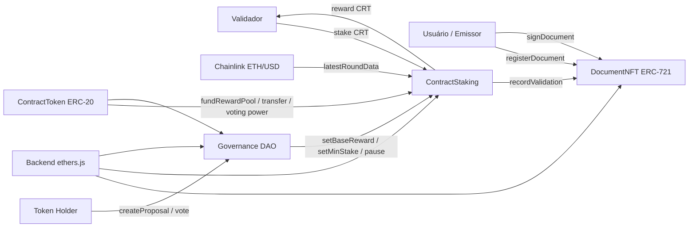

# MVP Web3 — Contratos e Documentos com Validação On-Chain

Projeto acadêmico estruturado para o estudo de caso **"Contratos"**, atendendo ao enunciado que exige **ERC-20, NFT, staking, governança simplificada, oráculo, integração Web3 e deploy em testnet**. O núcleo funcional do caso de uso foi mantido aderente ao slide de MVP aceitável para contratos: **registrar hash, assinatura e verificação**.

## 1. Problema resolvido

Processos de contratação digital frequentemente sofrem com três fragilidades:

1. dificuldade de provar a integridade do documento depois da assinatura;
2. baixa rastreabilidade sobre quem registrou, assinou e validou o contrato;
3. falta de incentivo econômico para validadores e curadores do protocolo.

## 2. Solução proposta

O MVP cria um fluxo descentralizado em que:

- um documento é registrado por **hash** e representado por um **NFT ERC-721**;
- partes interessadas registram seu aceite/assinatura on-chain;
- validadores fazem **staking** do token do protocolo e validam documentos;
- a recompensa de validação é ajustada por um **oráculo Chainlink ETH/USD**;
- parâmetros do staking podem ser alterados por uma **DAO simplificada**;
- um **script ethers.js** demonstra o uso prático do sistema.

## 3. Arquitetura



## 4. Contratos

### `ContractToken.sol`
- ERC-20 via OpenZeppelin.
- símbolo: `CRT`.
- `MINTER_ROLE` para mint controlado.
- usado em staking, recompensas e governança.

### `DocumentNFT.sol`
- ERC-721 via OpenZeppelin.
- registra `documentHash`, `creator`, `createdAt`, `validationCount`, `externalReference`.
- mantém unicidade de hash.
- registra assinatura on-chain (`signDocument`).
- permite verificação por hash (`verifyByHash`).

### `ContractStaking.sol`
- staking com `ReentrancyGuard`, `Pausable`, `AccessControl` e `SafeERC20`.
- valida documentos apenas para carteiras com stake mínimo.
- consulta o oráculo `ETH/USD` e ajusta a recompensa por tiers.

### `ContractGovernanceDAO.sol`
- governança simplificada.
- criação de propostas baseada em `balanceOf` do token.
- votação e execução de parâmetros sobre o staking.
- ações suportadas:
  - alterar recompensa base;
  - alterar stake mínimo;
  - pausar staking;
  - despausar staking.

## 5. Segurança aplicada

- Solidity `^0.8.24`.
- `ReentrancyGuard` no staking.
- `AccessControl` para funções administrativas.
- `Pausable` no staking.
- `SafeERC20` para transferências do token.
- prevenção de duplicidade de hash do documento.
- prevenção de validação duplicada por validador.
- validações explícitas de endereço zero, quantidade zero e parâmetros críticos.
- padrão **checks-effects-interactions** no staking.

## 6. Oráculo

O contrato de staking usa `AggregatorV3Interface` para consultar **ETH/USD**. A lógica do MVP aplica um tier simples:

- `>= 3500 USD` → `2x` recompensa base
- `>= 2500 USD` → `1.5x` recompensa base
- abaixo disso → recompensa base

> Observação: para produção, o ideal é calibrar a fórmula econômica com maior rigor e monitorar staleness do feed.

## 7. Integração Web3

O arquivo `scripts/demo.js` demonstra:

1. funding do pool de recompensa;
2. transferência de tokens ao validador;
3. registro de documento como NFT;
4. assinatura on-chain;
5. stake do validador;
6. validação do documento com recompensa;
7. criação de proposta de governança;
8. votação;
9. verificação final do documento por hash.

## 8. Deploy em Sepolia

### Pré-requisitos

- Node.js 20+
- carteira com ETH de teste
- RPC Sepolia
- endereço do feed ETH/USD da rede escolhida

### Instalação

```bash
npm install
cp .env.example .env
```

### Compilar

```bash
npx hardhat compile
```

### Deploy

```bash
npx hardhat run scripts/deploy.js --network sepolia
```

### Conceder roles após deploy

```bash
npx hardhat run scripts/grantRoles.js --network sepolia
```

## 9. Campos para entrega final

Preencher após o deploy real:

- Rede usada:
- Endereço do `ContractToken`:
- Endereço do `DocumentNFT`:
- Endereço do `ContractStaking`:
- Endereço do `ContractGovernanceDAO`:
- Hash da transação de deploy:
- Hash de execução de exemplo (registro/validação/voto):
- Link do explorer:
- Link do GitHub:

## 10. Limitações conhecidas do MVP

- a DAO não usa snapshot de saldo, então não é adequada para produção sem aprimoramento;
- a assinatura do documento é uma atestação on-chain simples, não um fluxo jurídico completo com EIP-712;
- o modelo não implementa slashing de validadores;
- o valor jurídico do documento continua dependendo do processo de negócio e da camada legal/off-chain.

## 11. Estrutura do repositório

```text
contracts/
  ContractToken.sol
  DocumentNFT.sol
  ContractStaking.sol
  ContractGovernanceDAO.sol
  MockPriceFeed.sol
  interfaces/
scripts/
  deploy.js
  grantRoles.js
  demo.js
test/
  ProtocolSmoke.test.js
docs/
  relatorio_tecnico_base.md
  roteiro_video.md
audit/
  relatorio_auditoria_base.md
```
